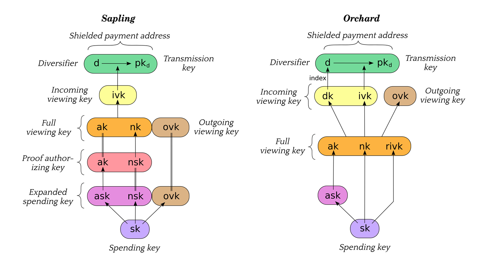

# Boilerplate commands

## Overview

| Command name | INS | Description |
| --- | --- | --- |
| `GET_VERSION` | 0x03 | Get application version as `MAJOR`, `MINOR`, `PATCH` |
| `GET_APP_NAME` | 0x04 | Get ASCII encoded application name |
| `INITIALIZE` | 0x05 | Initialize the wallet and derive the secret keys for a given account |
| `GET_PUBKEY` | 0x06 | Get the transparent public key |
| `GET_FVK` | 0x07 | Get the sapling diversified full viewing key |
| `GET_OFVK` | 0x08 | Get the orchard diversified full viewing key |
| `GET_PROOFGEN_KEY` | 0x09 | Get the sapling proof generation key |
| `INIT_TX` | 0x10 | Start the transaction signing workflow |
| `CHANGE_STAGE` | 0x11 | Step to the next stage of the signing workflow |
| `ADD_T_IN` | 0x12 | Add a transparent input amount |
| `ADD_T_OUT` | 0x13 | Add a transparent output |
| `ADD_S_OUT` | 0x14 | Add a sapling output |
| `ADD_O_ACTION` | 0x15 | Add an orchard action |
| `SET_S_NET` | 0x16 | Set the sapling net value |
| `SET_O_NET` | 0x17 | Set the orchard net value |
| `SET_HEADER_DIGEST` | 0x18 | Set the tx header digest |
| `SET_T_MERKLE_PROOF` | 0x19 | Provide the transparent merkle proof |
| `SET_S_MERKLE_PROOF` | 0x1A | Provide the sapling merkle proof |
| `SET_O_MERKLE_PROOF` | 0x1B | Provide the orchard merkle proof |
| `CONFIRM_FEE` | 0x1C | Ask the user to confirm the fees |
| `GET_PROOFGEN_KEY` | 0x20 | Get the sapling zk-proof generation key |
| `SIGN_TRANSPARENT` | 0x21 | Sign a transparent input |
| `SIGN_SAPLING` | 0x22 | Sign a sapling input |
| `SIGN_ORCHARD` | 0x23 | Sign an orchard action |
| `GET_S_SIGHASH` | 0x24 | Get the binding signature hash |
| `END_TX` | 0x30 | End the transaction signing workflow |

## NOTES

- Commands from 0x10 to 01F implement the transaction definition protocol.
The user will be asked to confirm every output and fee. After that,
the app can use Commands 0x20 to 0x30. If the user rejects the transaction,
calling 0x21-0x23 will result in an error INVALID_STATE.
- It is recommended to use the transaction building library included in `zcash-sync`
on which YWallet is built. This library will take care of executing the
signing workflow based on a transaction defined in JSON.

## GET_VERSION

### Command

| CLA | INS | P1 | P2 | Lc | CData |
| --- | --- | --- | --- | --- | --- |
| 0xE0 | 0x03 | 0x00 | 0x00 | 0x00 | - |

### Response

| Response length (bytes) | SW | RData |
| --- | --- | --- |
| 3 | 0x9000 | `MAJOR (1)` \|\| `MINOR (1)` \|\| `PATCH (1)` |

## GET_APP_NAME

### Command

| CLA | INS | P1 | P2 | Lc | CData |
| --- | --- | --- | --- | --- | --- |
| 0xE0 | 0x04 | 0x00 | 0x00 | 0x00 | - |

### Response

| Response length (bytes) | SW | RData |
| --- | --- | --- |
| var | 0x9000 | `APPNAME (var)` |

## INITIALIZE

### Command

| CLA | INS | P1 | P2 | Lc | CData |
| --- | --- | --- | --- | --- | --- |
| 0xE0 | 0x05 | account | 0x00 | 0x00 | - |

### Response

| Response length (bytes) | SW | RData |
| --- | --- | --- |
| 00 | 0x9000 | - |

## GET_PUBKEY

### Command

| CLA | INS | P1 | P2 | Lc | CData |
| --- | --- | --- | --- | --- | --- |
| 0xE0 | 0x06 | 0x00 | 0x00 | 0x00 | - |

### Response

| Response length (bytes) | SW | RData |
| --- | --- | --- |
| 33 | 0x9000 | Compressed transparent public key |

## GET_FVK

### Command

| CLA | INS | P1 | P2 | Lc | CData |
| --- | --- | --- | --- | --- | --- |
| 0xE0 | 0x07 | 0x00 | 0x00 | 0x00 | - |

### Response

| Response length (bytes) | SW | RData |
| --- | --- | --- |
| 0x80 | 0x9000 | ak,nk,ovk,dk |

- ak: authorization public key
- nk: nullifier public key
- ovk: outgoing viewing key
- dk: diversifier key

Together, they form the diversified full viewing key that
allows the decryption of incoming and outgoing notes and
the creation of diversified addresses.

## GET_OFVK

### Command

| CLA | INS | P1 | P2 | Lc | CData |
| --- | --- | --- | --- | --- | --- |
| 0xE0 | 0x08 | 0x00 | 0x00 | 0x00 | - |

### Response

| Response length (bytes) | SW | RData |
| --- | --- | --- |
| 0x60 | 0x9000 | ak,nk,rivk |

- ak: authorization public key
- nk: nullifier public key
- rivk: randomized 

## GET_PROOFGEN_KEY

### Command

| CLA | INS | P1 | P2 | Lc | CData |
| --- | --- | --- | --- | --- | --- |
| 0xE0 | 0x09 | 0x00 | 0x00 | 0x00 | - |

This key is needed to compute the zero knowledge proof.

### Response

| Response length (bytes) | SW | RData |
| --- | --- | --- |
| 0x40 | 0x9000 | ak,nsk |

- ak: authorization public key
- nsk: nullifier secret key

Remark: ak is part of the diversified full viewing key that we obtained earlier. It is sent 
again for completeness.

# Transaction Signing Commands

[TRANSACTION](TRANSACTION.md)

## Status Words

| SW | SW name | Description |
| --- | --- | --- |
| 0x6985 | `SW_DENY` | Rejected by user |
| 0x6A86 | `SW_WRONG_P1P2` | Either `P1` or `P2` is incorrect |
| 0x6A87 | `SW_WRONG_DATA_LENGTH` | `Lc` or minimum APDU length is incorrect |
| 0x6D00 | `SW_INS_NOT_SUPPORTED` | No command exists with `INS` |
| 0x6E00 | `SW_CLA_NOT_SUPPORTED` | Bad `CLA` used for this application |
| 0xB000 | `SW_WRONG_RESPONSE_LENGTH` | Wrong response length (buffer size problem) |
| 0xB007 | `SW_BAD_STATE` | Security issue with bad state |
| 0x9000 | `OK` | Success |
