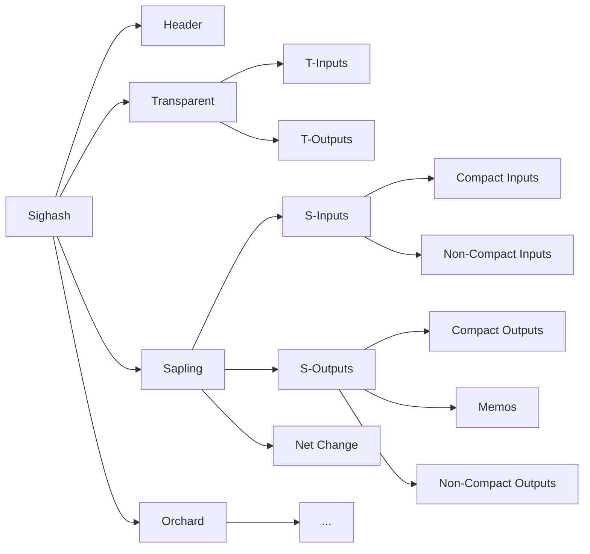
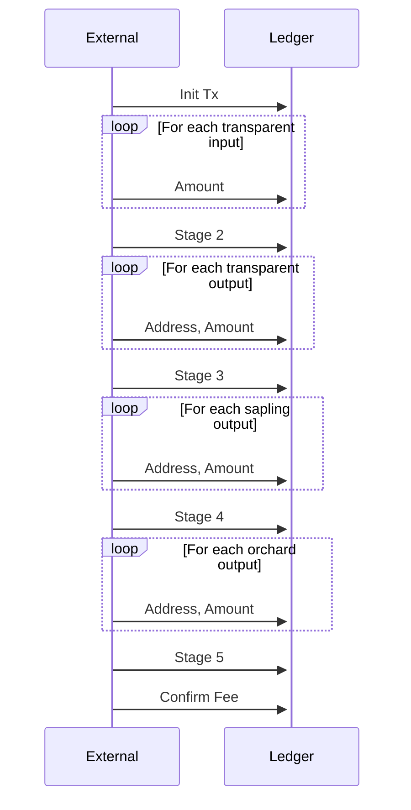

# Design and Implementation

A Ledger app has basically two main jobs:
- derive the various keys from secret material (seed phrase),
- sign transactions initiated from the companion wallet

The key derivation process is entirely internal to the Hardware
Wallet (H/W). As such it follows closely the protocol definition.
The H/W works as micro computer and can execute all the instructions
needed for this task.

Obviously we have to build the crypto primitives specific to Zcash
as described in the document [PRIMITIVES](PRIMITIVES.md) but the process
is familiar.

However, when it comes to signing a Zcash transaction, things are much
more complex than usual. Therefore, we'll focus mainly on this part.

# Zcash Pools

Zcash is essentially three cryptocurrencies in one. There are 3 distinct
pools of funds: Transparent, Sapling and Orchard. Funds in each of these
pools are not directly fungible. However, one can issue a transaction
that sends funds from/to any of these pools for a 1 to 1 exchange rate.
Basically, it is the same idea as coins vs notes.

Yet, this means we have to work with 3 different crypto systems.
Let's briefly introduce them.

## Transparent

The Transparent pool is closely related to Bitcoin. Most of the protocol
is the same. We'll assume the reader is familiar with the Bitcoin protocol.

## Sapling

The Sapling pool is the 2nd type of shielded (i.e. encrypted) pool. The first
one, Sprout, is now nearly deprecated and it is not supported by modern wallets
anymore.

In Sapling, transactions inputs and outputs are encrypted. Amounts and addresses
are both hidden unless you are the recipient or you have a viewing key.
Zero Knowledge Proofs are used to ensure that the transaction still follows
the protocol.

## Orchard

The Orchard pool has the same property as the Sapling pool. The proving system
does not require a trusted setup. Besides that, from a user perspective it works the
same way.

# Zcash Transaction

A Zcash transaction is combination of 3 bundles corresponding to the inputs and outputs
of each pool. For instance, you can have a transaction with input from the transparent
pool and outputs to the sapling pool. This transaction is commonly referred to as t2z.
But there are many other possibilities.

> The Zcash Ledger App supports every type of transaction with the exception of
coinbase transactions.

## Challenges of Signing a Zcash tx

A normal wallet would build the unsigned transaction, then create the zero knowledge proofs 
and apply the signatures to form the final signed transaction.

Signatures are computed from the secret key and the *signature hash*.

Since the signature hash derives from the content of the transaction without the witness
data, it is essentially equivalent to signing the transaction parameters.

Hardware Wallets cannot possibly do the same thing with Zcash. The generation of the zk-proof
is too compute and resource intensive for a H/W. Thankfully, the designers of the protocol have
taken this into consideration.

Yet, the Zcash app needs to take advantage of these features otherwise it will not be
able to produce the signature.

## Sighash

Signing is actually the simplest part of the process. The most difficult part is
knowing what to sign, i.e. computing the signature hash (sighash).

There are two reasons for that.

1. The H/W cannot trust anything coming from the outside. Any sensitive information
should be displayed and confirmed by the user, and MUST be included in the sighash.
The H/W must not say it pays Alice and sign a transaction paying Bob.

Therefore, the H/W MUST calculate the sighash internally. It CANNOT trust a sighash
coming from the outside.

2. The sighash that the protocol expects is calculated from ENCRYPTED data. However,
we want the H/W to display PLAIN data to the user for confirmation. 

A somewhat naive implementation would have the H/W receive the transaction parameters
and have it create a unsigned tx, encrypt it, calculate the sighash and apply the signatures.
The zk-proof are not covered by the sighash and could be produced by externally.

In practice, this is too much work and at best the H/W would only support small transactions.

# Solution

Our solution uses the sighash definition of ZIP-244 that was introduced in NU-5 
(Network Upgrade #5) and used in Transaction Version 5.

In TxV5, the sighash is not simply a hash computed on the serialized transaction
parameters. It is the root of a merkle tree where the leaves are hashes of
sections of the transaction.

In this slightly simplified diagram, we can see the relationship between the 
elements of the transaction and various hashes.



We recognize the inputs and outputs of the transparent section, but for Sapling (and Orchard)
inputs and outputs are further split into compact and non-compact.

This design is to help light wallets so that they do not have to download the entire
transaction and yet be able to verify it. 

If a program wants to compute the sighash, it has now the option to subsitute
an internally calculated hash with a hash coming from an external source.

For example, let's say that a program does not need to check the inputs
but wants to check the outputs. It can receive the outputs and hash them to 
get the output hash. However, it can skip receiving the inputs and directly
get the input hash.

The sender can obviously provide an incorrect hash for the input but since we
calculate the hash for the outputs, we know that the output hash is correct.
Then after we hash the input and output hashes together, we obtain an incorrect hash.

In other words, the signature on this sighash is *locked* on the outputs.

A malicious external agent could provide invalid inputs but it cannot use our
signature with different outputs.

This is called a Merkle Proof and is the foundation of Simplified Payment Verification
(or SPV).

## Merkle Proof

We want to ensure that the app signs a transaction that has the correct:
- output addresses and amounts
- fee

Like in Bitcoin, the fee is not directly part of the transaction but is the result
of deducting the output amount from the input amount.

Therefore, we want to lock:
- transparent, sapling, orchard outputs (amount & address),
- transparent input amount
- sapling net value change: all input sapling values - all output sapling values
- orchard net value change

This determines the content of the Merkle proofs:

```c
typedef struct {
    uint8_t prevouts_sig_digest[32];
    uint8_t scriptpubkeys_sig_digest[32];
    uint8_t sequence_sig_digest[32];
} t_proofs_t;

typedef struct {
    uint8_t sapling_spends_digest[32];
    uint8_t sapling_outputs_memos_digest[32];
    uint8_t sapling_outputs_noncompact_digest[32];
} s_proofs_t;

typedef struct {
    uint8_t orchard_anchor[32];
    uint8_t orchard_memos_digest[32];
    uint8_t orchard_noncompact_digest[32];
} o_proofs_t;
```

For example, regarding the sapling pool, we do not need to get
any input at all. We can just get the hash. For the outputs,
we don't verify the memos or the non compact data.

Since we do not trust the compact data, which has the output
address and amount, we don't include it in the Merkle Proof
and compute it ourselves.

## Note Commitments

Using Merkle Proofs greatly reduces the amount of calculation
we have to do in the H/W app. However, we still have a problem.

The output parameters are in PLAIN but the content of the transaction
is ENCRYPTED.

We could encrypt it ourself but then we have to implement the 
whole encryption protocol. It has an ephemeral key generation,
key agreement, key stretching and encryption.

Instead of doing all of that, we can leverage the way the protocol
records spends. In the protocol, a commitment value is computed
from the plain note data and added to the transaction data in
the compact output field.

Therefore, we receive the address and amount of the output.
Then we add some randomness as required by the protocol (rseed).
From that, we compute the note commitment and we include that in
the compact output digest.

The external wallet must perform the exact same process in order
to generate the same raw transaction. Therefore, the source of
randomness has to be synchronized. The H/W chooses a seed
and transmits it to the external wallet. The later must follow
or the transaction will not be valid.

# Sequence Diagram

Finally, we can describe the workflow of a transaction signature.



Also, at any time before the fee confirmation, the external agent must
send:
- the hash of the header
- the transparent, sapling and orchard merkle proofs,
- the net value change of the sapling and orchard parts.

If the transaction does not contain some of the pools, the external agent
is not required to send the corresponding proofs, net values but
it must go through the steps 1 to 5. 

It is not allowed to skip from step 1 to step 3 because there is no transparent part.

> The user is asked to confirm every output parameter if the amount is not zero
and if the destination is not the address of the H/W.

If he does, the H/W will accept calls to sign input.

Transparent inputs are handled a bit differently because their sighash includes
the input parameter. The H/W gets the hash of the transparent input.

The sighash of every shielded input is the same. Therefore the H/W caches it.
The signature must be calculated because there is a rerandomization factor.
