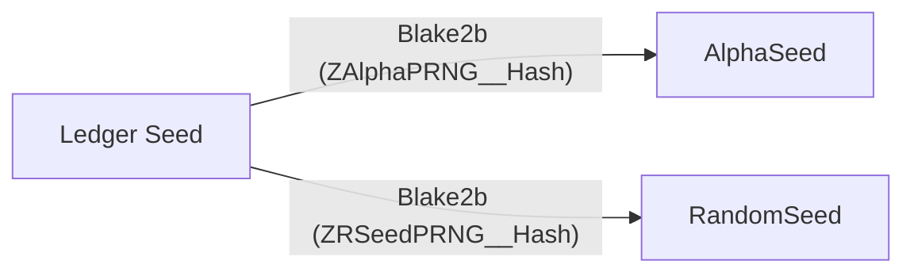

# Transaction Signing Commands

> It is recommended to use the transaction building library included in `zcash-sync`
on which YWallet is built. This library will take care of executing the
signing workflow based on a transaction defined in JSON.

# Transaction Definition

These commands send the transaction parameters to the Ledger device

## INIT_TX

### Command

| CLA | INS | P1 | P2 | Lc | CData |
| --- | --- | --- | --- | --- | --- |
| 0xE0 | 0x10 | 0x00 | 0x00 | 0x00 | - |

### Response

| Response length (bytes) | SW | RData |
| --- | --- | --- |
| 0x20 | 0x9000 | randomization seed |

Each shielded sapling output and each action has a
randomization factor (rseed). The Ledger controls
them by issuing a master random value which serves
seed the Chacha20 RNG.

There are two sequences of random values:
- Alpha, used in rerandomization of the input signatures
- RandomSeed, used in rerandomization of output notes.

The Ledger returns a random value that the companion wallet MUST
use after Blake2b 256-bit hashing with the
given personalization string.

## CHANGE_STAGE

### Command

| CLA | INS | P1 | P2 | Lc | CData |
| --- | --- | --- | --- | --- | --- |
| 0xE0 | 0x11 | stage | 0x00 | 0x00 | - |

### Response

| Response length (bytes) | SW | RData |
| --- | --- | --- |
| 0x00 | 0x9000 | - |

Change the signing stage. Use this command when you 
want to go to the next stage. **You cannot skip stages**.

| Stage | Messages |
| --- | --- |
| 1 | Transparent Inputs | 
| 2 | Transparent Outputs | 
| 3 | Sapling Outputs | 
| 4 | Orchard Actions | 
| 5 | Fee Confirmation | 

## ADD_T_IN

### Command

| CLA | INS | P1 | P2 | Lc | CData |
| --- | --- | --- | --- | --- | --- |
| 0xE0 | 0x12 | 0x00 | 0x00 | 0x08 | amount in zats |

- Send a transparent input amount in zats (Little Endian 64 bit integer)
- Repeat for each transparent input

### Response

| Response length (bytes) | SW | RData |
| --- | --- | --- |
| 0x00 | 0x9000 | - |

## ADD_T_OUT

### Command

| CLA | INS | P1 | P2 | Lc | CData |
| --- | --- | --- | --- | --- | --- |
| 0xE0 | 0x13 | 0x00 | 0x00 | 29 | amount,address_type,address_hash |

- Send a transparent output. An TxOut has an amount and an address
- At this point, address_type must be 0 and denotes a pay to public key hash
- The address hash is a 20 byte value

- Repeat for each transparent output

### Response

| Response length (bytes) | SW | RData |
| --- | --- | --- |
| 0x00 | 0x9000 | - |

## ADD_S_OUT

### Command

| CLA | INS | P1 | P2 | Lc | CData |
| --- | --- | --- | --- | --- | --- |
| 0xE0 | 0x14 | 0x00 | 0x00 | 43+8+32+52 | address,amount,epk,compact enc |

- Send a sapling output. An SOut includes an amount and an address
- The epk and compact encrypted data are defined in [the Zcash Protocol spec](https://zips.z.cash/protocol/protocol.pdf). They can be computed using the `librustzcash` crate.

- Repeat for each sapling output

### Response

| Response length (bytes) | SW | RData |
| --- | --- | --- |
| 0x00 | 0x9000 | - |

## ADD_O_ACTION

### Command

| CLA | INS | P1 | P2 | Lc | CData |
| --- | --- | --- | --- | --- | --- |
| 0xE0 | 0x15 | 0x00 | 0x00 | 32+43+8+32+52 | nullifier,address,amount,epk,compact enc |

- Send an orchard output. An OAction includes an amount and an address
- The nullifier, epk and compact encrypted data are defined in [the Zcash Protocol spec](https://zips.z.cash/protocol/protocol.pdf). They can be computed using the `orchard` crate.

- Repeat for each orchard action

### Response

| Response length (bytes) | SW | RData |
| --- | --- | --- |
| 0x00 | 0x9000 | - |

## SET_S_NET

### Command

| CLA | INS | P1 | P2 | Lc | CData |
| --- | --- | --- | --- | --- | --- |
| 0xE0 | 0x16 | 0x00 | 0x00 | 0x08 | net sapling value |

The net value is the difference between the input amounts and the output amounts. It can be
negative.

### Response

| Response length (bytes) | SW | RData |
| --- | --- | --- |
| 0x00 | 0x9000 | - |

## SET_O_NET

### Command

| CLA | INS | P1 | P2 | Lc | CData |
| --- | --- | --- | --- | --- | --- |
| 0xE0 | 0x17 | 0x00 | 0x00 | 0x08 | net orchard value |

The net value is the difference between the input amounts and the output amounts. It can be
negative.

### Response

| Response length (bytes) | SW | RData |
| --- | --- | --- |
| 0x00 | 0x9000 | - |

## SET_HEADER_DIGEST

### Command

| CLA | INS | P1 | P2 | Lc | CData |
| --- | --- | --- | --- | --- | --- |
| 0xE0 | 0x18 | 0x00 | 0x00 | 0x20 | header digest |

The header digest is defined in [ZIP-244](https://zips.z.cash/zip-0244)

### Response

| Response length (bytes) | SW | RData |
| --- | --- | --- |
| 0x00 | 0x9000 | - |

## SET_T_MERKLE_PROOF

### Command

| CLA | INS | P1 | P2 | Lc | CData |
| --- | --- | --- | --- | --- | --- |
| 0xE0 | 0x19 | 0x00 | 0x00 | 0x60 | prevouts_digest, scriptpubkeys_sig_digest, sequence_sig_digest |

They are defined [ZIP-244](https://zips.z.cash/zip-0244)

### Response

| Response length (bytes) | SW | RData |
| --- | --- | --- |
| 0x00 | 0x9000 | - |

## SET_S_MERKLE_PROOF

### Command

| CLA | INS | P1 | P2 | Lc | CData |
| --- | --- | --- | --- | --- | --- |
| 0xE0 | 0x1A | 0x00 | 0x00 | 0x60 | sapling_spends_digest, sapling_outputs_memos_digest, sapling_outputs_noncompact_digest |

They are defined [ZIP-244](https://zips.z.cash/zip-0244)

### Response

| Response length (bytes) | SW | RData |
| --- | --- | --- |
| 0x00 | 0x9000 | - |

## SET_O_MERKLE_PROOF

### Command

| CLA | INS | P1 | P2 | Lc | CData |
| --- | --- | --- | --- | --- | --- |
| 0xE0 | 0x1B | 0x00 | 0x00 | 0x60 | anchor, orchard_actions_memos_digest, orchard_actions_noncompact_digest |

They are defined [ZIP-244](https://zips.z.cash/zip-0244)

### Response

| Response length (bytes) | SW | RData |
| --- | --- | --- |
| 0x00 | 0x9000 | - |

## CONFIRM_FEE

### Command

| CLA | INS | P1 | P2 | Lc | CData |
| --- | --- | --- | --- | --- | --- |
| 0xE0 | 0x1C | 0x00 | 0x00 | 0x00 | - |

Ask the user to confirm the fee. After confirmation, the
transaction is ready to be signed.

Note that because the transaction must go through every stage,
getting the fee confirmation implies that the user has also
confirmed every output.

### Response

| Response length (bytes) | SW | RData |
| --- | --- | --- |
| 0x00 | 0x9000 | - |

# Signing

## SIGN_TRANSPARENT

### Command

| CLA | INS | P1 | P2 | Lc | CData |
| --- | --- | --- | --- | --- | --- |
| 0xE0 | 0x21 | 0x00 | 0x00 | 0x20 | txin_sig_digest |

Sign a transparent input. txin_sig_digest is defined in [ZIP-244](https://zips.z.cash/zip-0244)

- Repeat for each transparent input

### Response

| Response length (bytes) | SW | RData |
| --- | --- | --- |
| var | 0x9000 | DER encoded signature |

## SIGN_SAPLING

### Command

| CLA | INS | P1 | P2 | Lc | CData |
| --- | --- | --- | --- | --- | --- |
| 0xE0 | 0x22 | 0x00 | 0x00 | 0x00 | - |

Sign a sapling input.
- Repeat for each sapling input

### Response

| Response length (bytes) | SW | RData |
| --- | --- | --- |
| var | 0x9000 | DER encoded signature |

## SIGN_ORCHARD

### Command

| CLA | INS | P1 | P2 | Lc | CData |
| --- | --- | --- | --- | --- | --- |
| 0xE0 | 0x23 | 0x00 | 0x00 | 0x00 | - |

Sign an orchard input.
- Repeat for each orchard input

### Response

| Response length (bytes) | SW | RData |
| --- | --- | --- |
| 0x40 | 0x9000 | r,s |

## GET_S_SIGHASH

### Command

| CLA | INS | P1 | P2 | Lc | CData |
| --- | --- | --- | --- | --- | --- |
| 0xE0 | 0x23 | 0x00 | 0x00 | 0x00 | - |

Get the shielded signature hash. It used to calculate the binding signature.

### Response

| Response length (bytes) | SW | RData |
| --- | --- | --- |
| 0x20 | 0x9000 | sig_hash |

# END

## END_TX

### Command

| CLA | INS | P1 | P2 | Lc | CData |
| --- | --- | --- | --- | --- | --- |
| 0xE0 | 0x30 | 0x00 | 0x00 | 0x00 | - |

Finish the signature workflow. 

### Response

| Response length (bytes) | SW | RData |
| --- | --- | --- |
| 0x00 | 0x9000 | - |

